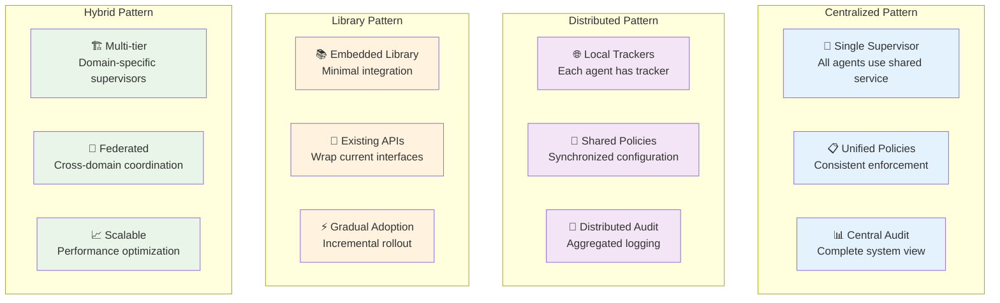

# Implementation Architecture

## Architecture Patterns

### Centralized Supervisor Pattern

**When to use**: Production systems requiring consistent policy enforcement and comprehensive audit trails.

**The Taint Supervisor Problem**: Traditional taint tracking embeds taint assignment directly in pipeline code, leading to scattered decisions, policy inconsistency, no audit trail, and testing complexity.

**Solution**: A centralized Taint Supervisor that handles:
1. **Source Registration** - Only place where taint labels are assigned to raw data
2. **Policy Management** - Owns sink policy configuration using TSL specifications  
3. **Audit Logging** - Records every taint assignment and sink check with full context

**Characteristics**:
- Single taint supervisor instance manages all operations
- All agents communicate through the supervisor for taint operations
- Centralized policy management and audit logging
- Strong consistency guarantees

**Trade-offs**:
- ✅ Consistent policy enforcement across all agents
- ✅ Complete audit trail and system visibility
- ✅ Simplified policy management and updates
- ❌ Single point of failure
- ❌ Potential performance bottleneck
- ❌ Network latency for distributed agents

### Distributed Tracking Pattern

**When to use**: Microservices or distributed agent systems where centralization is impractical.

**Characteristics**:
- Each agent has its own taint tracker instance
- Shared policy store (Redis, database, config service)
- Distributed audit logging with aggregation
- Eventual consistency model

**Trade-offs**:
- ✅ Better performance and fault tolerance
- ✅ Scales with system growth
- ✅ Reduced network dependencies
- ❌ Policy synchronization complexity
- ❌ Distributed audit log management
- ❌ Potential consistency issues

### Library Integration Pattern

**When to use**: Adding taint tracking to existing systems with minimal architectural changes.

**Characteristics**:
- Taint tracking as embedded library
- Wraps existing APIs and data structures
- Gradual adoption without major refactoring
- Local policy enforcement

**Trade-offs**:
- ✅ Minimal integration effort
- ✅ Backwards compatibility
- ✅ Incremental adoption
- ❌ Limited system-wide visibility
- ❌ Inconsistent policy enforcement
- ❌ Scattered audit information

### Hybrid Pattern

**When to use**: Large systems with multiple security domains or performance requirements.

**Characteristics**:
- Hierarchical supervisor structure
- Domain-specific policy enforcement
- Cross-domain coordination protocols
- Multi-tier audit aggregation

**Trade-offs**:
- ✅ Flexible and scalable architecture
- ✅ Domain-specific optimization
- ✅ Fault isolation between domains
- ❌ Complex coordination logic
- ❌ Potential policy conflicts
- ❌ Increased operational complexity

## Component Architecture

### Core Components

**Taint Supervisor**
- Central coordination point for taint operations
- Manages policy enforcement and audit logging
- Handles source registration and taint assignment

**Policy Engine**
- Interprets and enforces TSL policies
- Manages taint hierarchies and propagation rules
- Provides policy validation and conflict resolution

**Audit System**
- Records all taint operations and policy decisions
- Provides structured logging for compliance and analysis
- Supports real-time monitoring and alerting

**Source Registry**
- Maps data sources to taint kinds
- Manages source patterns and identification rules
- Provides source metadata for audit trails

### Integration Interfaces

**Agent Integration**
- Standardized APIs for taint operations
- Middleware for transparent taint propagation
- Error handling and fallback mechanisms

**Policy Management**
- TSL policy loading and validation
- Runtime policy updates and rollback
- Policy versioning and change tracking

**Monitoring Integration**
- Metrics collection for performance monitoring
- Health checks and system status reporting
- Integration with existing monitoring systems

## Implementation Strategies

### Gradual Adoption Approach

**Phase 1: Foundation**
- Implement core taint tracking library
- Add taint tracking to new components only
- Establish basic policy framework

**Phase 2: Critical Paths**
- Identify and instrument critical data flows
- Implement basic sink policies for high-risk operations
- Add audit logging for security-sensitive operations

**Phase 3: System Integration**
- Extend taint tracking to existing components
- Implement comprehensive policy enforcement
- Add cross-component taint propagation

**Phase 4: Advanced Features**
- Add topology inference and analytics
- Implement dynamic policy management
- Optimize performance and scalability

### Backwards Compatibility

**API Compatibility**
- Maintain existing interfaces while adding taint support
- Use wrapper types for gradual migration
- Provide fallback behavior for non-taint-aware code

**Data Compatibility**
- Support both tainted and untainted data in APIs
- Automatic taint assignment for legacy data sources
- Graceful degradation when taint information is missing

**Configuration Compatibility**
- Support existing configuration formats
- Gradual migration to TSL-based policies
- Default policies for unconfigured components

## Performance Considerations

### Optimization Strategies

**Lazy Evaluation**
- Defer expensive taint computations until needed
- Cache computed taint sets for reuse
- Optimize common taint propagation patterns

**Caching**
- Cache policy decisions for frequently accessed sinks
- Cache taint set computations for common operations
- Use memory-efficient cache eviction strategies

**Asynchronous Operations**
- Non-blocking audit logging
- Asynchronous policy updates
- Background taint set optimization

**Batch Processing**
- Group multiple taint operations for efficiency
- Batch audit log writes
- Bulk policy validation and updates

### Scalability Patterns

**Horizontal Scaling**
- Distribute taint supervisors across multiple instances
- Load balance taint operations
- Partition data by security domain or agent type

**Vertical Scaling**
- Optimize memory usage for taint metadata
- Use efficient data structures for taint sets
- Minimize CPU overhead of taint operations

**Resource Management**
- Monitor and limit memory usage of taint tracking
- Implement circuit breakers for overloaded components
- Graceful degradation under resource pressure

## Deployment Considerations

### Deployment Patterns

**Blue-Green Deployment**
- Deploy policy changes to staging environment first
- Test with production traffic before switching
- Quick rollback capability for policy issues

**Canary Deployment**
- Gradual rollout of new policies or features
- Monitor metrics during rollout
- Automatic rollback on anomaly detection

**Feature Flags**
- Control taint enforcement independently of deployment
- A/B test different policy configurations
- Emergency disable capability for critical issues

### Operational Concerns

**Monitoring and Alerting**
- Track policy violation rates and patterns
- Monitor performance impact of taint tracking
- Alert on unusual taint propagation patterns

**Backup and Recovery**
- Regular backups of policy configurations
- Audit log retention and archival
- Disaster recovery procedures for taint systems

**Security**
- Protect policy configurations from unauthorized changes
- Secure audit logs against tampering
- Monitor for attempts to bypass taint tracking

## Testing Architecture

### Testing Strategies

**Unit Testing**
- Test individual taint operations and policy rules
- Validate taint propagation correctness
- Test error handling and edge cases

**Integration Testing**
- Test component interactions and data flows
- Validate policy enforcement across system boundaries
- Test audit logging and monitoring integration

**System Testing**
- End-to-end testing of complete taint flows
- Performance testing under realistic loads
- Security testing against attack scenarios

**Chaos Testing**
- Test behavior under component failures
- Validate graceful degradation mechanisms
- Test recovery procedures and data consistency

### Test Environment Management

**Environment Isolation**
- Separate test environments for different test types
- Isolated policy configurations for testing
- Test data management and cleanup

**Continuous Testing**
- Automated testing in CI/CD pipelines
- Performance regression testing
- Security vulnerability scanning

This architectural framework provides the foundation for implementing robust, scalable, and maintainable information flow tracking systems in production environments.