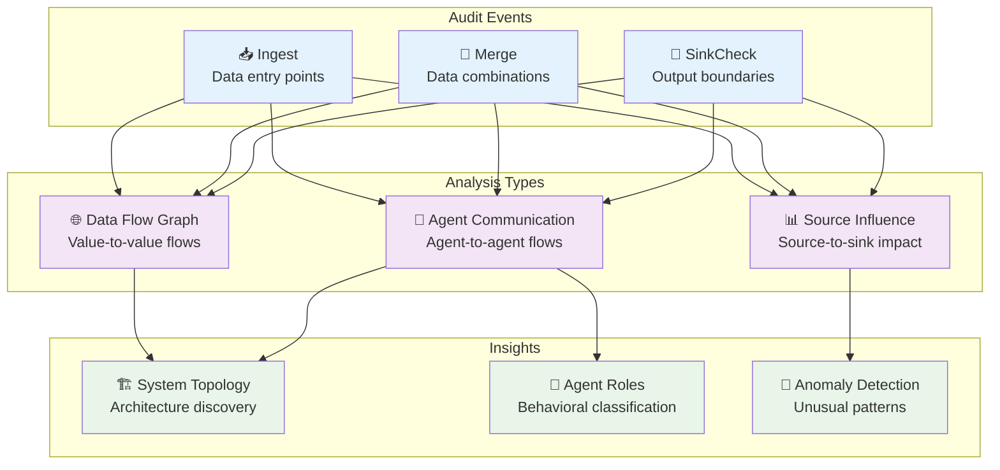

# Data Flow Topology Inference

## Overview

Taint audit logs contain rich information about how data flows through agent systems. By analyzing these logs, we can reconstruct system topology, agent communication patterns, and detect anomalies without requiring explicit system documentation.

## Analysis Approaches

### Data Flow Graph Reconstruction
Build directed graphs showing how data values flow through the system:
- **Basic flow graphs** - Adjacency lists mapping values to downstream values or sinks
- **Enhanced flow graphs** - Include timing, agents, taint kinds, and operations

### Agent Communication Analysis
Identify communication patterns between agents:
- **Agent-to-agent edges** - Which agents produce data consumed by other agents
- **Communication graphs** - Weighted graphs showing frequency and types of inter-agent flows
- **Role classification** - Identify sources, processors, sinks, and hub agents

### Source Influence Tracking
Track how external data sources affect system outputs:
- **Source reach** - Which sinks are ultimately influenced by specific external sources
- **Impact matrices** - Frequency of source-to-sink influence patterns
- **Lineage tracking** - Complete data provenance from source to sink

## Agent Role Patterns

**Sources** - Primarily ingest external data with few incoming connections
**Processors** - Transform and combine data with balanced input/output
**Sinks** - Output data to external systems with few outgoing connections
**Hubs** - High connectivity agents that bridge multiple subsystems
**Bridges** - Connect different security domains or trust levels

## Anomaly Detection

### Baseline Learning
- **Communication patterns** - Typical agent-to-agent data flows
- **Source/sink usage** - Expected external data sources and destinations
- **Flow volumes** - Normal data flow frequencies and volumes

### Deviation Detection
- **Unexpected communications** - New agent-to-agent data flows
- **Novel sources** - Previously unseen external data sources
- **Policy violation spikes** - Unusual increases in blocked operations

## Use Cases

**Security Monitoring** - Identify unusual data flow patterns indicating potential compromise
**System Understanding** - Reverse engineer system structure from runtime behavior
**Compliance Auditing** - Generate reports showing complete data provenance
**Performance Analysis** - Find bottlenecks in data processing pipelines

This approach transforms raw audit data into actionable insights about system behavior, security posture, and operational patterns.