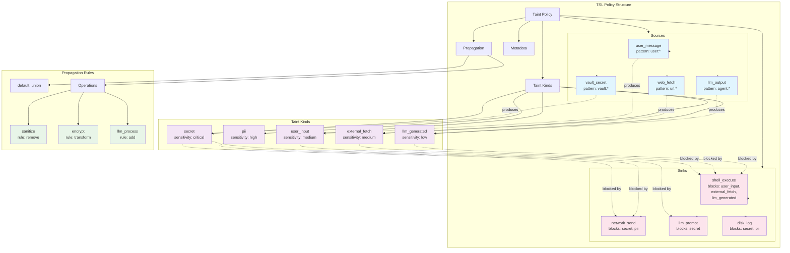
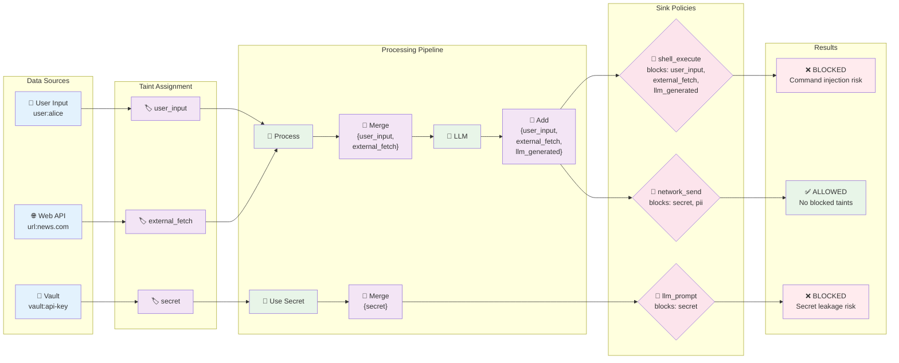

# Taint Specification Language (TSL)

## Overview

The Taint Specification Language (TSL) provides a declarative format for defining information flow tracking policies. Instead of hardcoding taint rules in application code, TSL allows policies to be specified externally and loaded at runtime.

## TSL Schema Overview



## Information Flow Diagram



## Core Concepts

### Taint Hierarchy
Define hierarchical relationships between taint types:

```yaml
# taint-policy.yaml
taint_hierarchy:
  untrusted:
    description: "Data from untrusted sources"
    sensitivity: medium
    children:
      - user_input
      - external_fetch
      - llm_generated
      
  sensitive:
    description: "Sensitive data requiring protection"
    sensitivity: high
    children:
      - pii
      - credentials
      
  secret:
    description: "Highly sensitive secrets"
    sensitivity: critical
    parent: sensitive
```

### Taint Kinds
Define the types of taint that can be tracked:

```yaml
# taint-policy.yaml
taint_kinds:
  user_input:
    description: "Data originating from user messages or input"
    sensitivity: medium
    
  external_fetch:
    description: "Data retrieved from external APIs or web sources"
    sensitivity: medium
    
  llm_generated:
    description: "Data produced by language model inference"
    sensitivity: low
    
  secret:
    description: "Credentials, API keys, or sensitive configuration"
    sensitivity: critical
    
  pii:
    description: "Personally identifiable information"
    sensitivity: high
```

### Sources
Define where taint originates:

```yaml
sources:
  user_message:
    taint: [user_input]
    pattern: "user:*"
    description: "User messages in chat interface"
    
  web_fetch:
    taint: [external_fetch]
    pattern: "url:*"
    description: "HTTP requests to external URLs"
    
  secret_vault:
    taint: [secret]
    pattern: "vault:*"
    description: "Secrets retrieved from vault"
    
  llm_inference:
    taint: [llm_generated]
    pattern: "agent:*"
    description: "LLM model outputs"
```

### Sinks
Define output boundaries and their policies:

```yaml
sinks:
  shell_execute:
    description: "Shell command execution"
    blocked_hierarchy: untrusted  # Blocks untrusted and all children
    reason: "Prevent command injection attacks"
    
  network_send:
    description: "Network requests and responses"
    blocked_hierarchy: sensitive  # Blocks sensitive and all children
    exceptions: [encrypted_pii]   # Allow encrypted PII
    reason: "Prevent data exfiltration"
    
  llm_prompt:
    description: "Input to language model"
    blocked_taints: [secret]
    reason: "Prevent secret leakage to model"
    
  public_log:
    description: "Public logging"
    max_sensitivity: medium       # Only allow medium sensitivity and below
    reason: "Prevent sensitive data in public logs"
    
  memory_store:
    description: "In-memory data storage"
    blocked_taints: []
    reason: "All taints permitted in memory"
```

### Propagation Rules
Define how taint flows through operations:

```yaml
propagation:
  default: automatic  # Enable automatic taint propagation
  
  automatic_rules:
    string_concat: merge_all     # String + String merges all taints
    arithmetic: merge_all        # Numeric operations merge all taints
    function_call: preserve      # Function calls preserve input taint
  
  operations:
    sanitize:
      rule: remove
      removes: [user_input, external_fetch]
      description: "Data sanitization removes untrusted input taint"
      
    encrypt:
      rule: transform
      input: [pii]
      output: [encrypted_pii]
      description: "Encryption transforms PII taint"
      
    llm_process:
      rule: add
      adds: [llm_generated]
      description: "LLM processing adds generated taint"
      
    validate_filename:
      rule: untaint_if_matches
      pattern: "^[a-zA-Z0-9._-]+$"
      removes: [user_input]
      description: "Remove user_input taint if filename is safe"
      
    extract_safe_content:
      rule: untaint_capture_groups
      pattern: "^(safe_prefix)_([a-zA-Z0-9]+)_(safe_suffix)$"
      removes: [external_fetch]
      captures: [1, 2]  # Only capture groups 1 and 2 are untainted
      description: "Extract safe parts from external content"
```

## JSON Schema

```json
{
  "$schema": "http://json-schema.org/draft-07/schema#",
  "title": "Taint Specification Language",
  "type": "object",
  "required": ["version", "taint_hierarchy", "sources", "sinks"],
  "properties": {
    "version": {
      "type": "string",
      "enum": ["2.0"]
    },
    "metadata": {
      "type": "object",
      "properties": {
        "name": {"type": "string"},
        "description": {"type": "string"},
        "author": {"type": "string"},
        "created": {"type": "string", "format": "date-time"}
      }
    },
    "taint_hierarchy": {
      "type": "object",
      "patternProperties": {
        "^[a-z_]+$": {
          "type": "object",
          "properties": {
            "description": {"type": "string"},
            "sensitivity": {
              "type": "string",
              "enum": ["low", "medium", "high", "critical"]
            },
            "parent": {"type": "string"},
            "children": {
              "type": "array",
              "items": {"type": "string"}
            }
          },
          "required": ["description", "sensitivity"]
        }
      }
    },
    "sources": {
      "type": "object",
      "patternProperties": {
        "^[a-z_]+$": {
          "type": "object",
          "properties": {
            "taint": {
              "type": "array",
              "items": {"type": "string"}
            },
            "pattern": {"type": "string"},
            "description": {"type": "string"}
          },
          "required": ["taint", "description"]
        }
      }
    },
    "sinks": {
      "type": "object",
      "patternProperties": {
        "^[a-z_]+$": {
          "type": "object",
          "properties": {
            "description": {"type": "string"},
            "blocked_taints": {
              "type": "array",
              "items": {"type": "string"}
            },
            "blocked_hierarchy": {"type": "string"},
            "max_sensitivity": {
              "type": "string",
              "enum": ["low", "medium", "high", "critical"]
            },
            "exceptions": {
              "type": "array",
              "items": {"type": "string"}
            },
            "reason": {"type": "string"}
          },
          "required": ["description", "blocked_taints"]
        }
      }
    },
    "propagation": {
      "type": "object",
      "properties": {
        "default": {
          "type": "string",
          "enum": ["automatic", "union", "intersection", "none"]
        },
        "automatic_rules": {
          "type": "object",
          "properties": {
            "string_concat": {"type": "string"},
            "arithmetic": {"type": "string"},
            "function_call": {"type": "string"}
          }
        },
        "operations": {
          "type": "object",
          "patternProperties": {
            "^[a-z_]+$": {
              "type": "object",
              "properties": {
                "rule": {
                  "type": "string",
                  "enum": ["union", "remove", "transform", "add", "untaint_if_matches", "untaint_capture_groups"]
                },
                "removes": {
                  "type": "array",
                  "items": {"type": "string"}
                },
                "adds": {
                  "type": "array",
                  "items": {"type": "string"}
                },
                "input": {
                  "type": "array",
                  "items": {"type": "string"}
                },
                "output": {
                  "type": "array",
                  "items": {"type": "string"}
                },
                "pattern": {"type": "string"},
                "captures": {
                  "type": "array",
                  "items": {"type": "integer"}
                },
                "description": {"type": "string"}
              },
              "required": ["rule", "description"]
            }
          }
        }
      }
    }
  }
}
```

## Complete Example

```yaml
version: "2.0"
metadata:
  name: "Agent System Taint Policy"
  description: "Information flow tracking policy for multi-agent system"
  author: "Security Team"
  created: "2025-01-16T00:00:00Z"

taint_hierarchy:
  untrusted:
    description: "Data from untrusted sources"
    sensitivity: medium
    children:
      - user_input
      - external_fetch
      - llm_generated
      
  sensitive:
    description: "Sensitive data requiring protection"
    sensitivity: high
    children:
      - pii
      - credentials
      
  secret:
    description: "Highly sensitive secrets"
    sensitivity: critical
    parent: sensitive

taint_kinds:
  user_input:
    description: "Data from user messages or interface input"
    sensitivity: medium
    parent: untrusted
  external_fetch:
    description: "Data from external APIs, web scraping, or file reads"
    sensitivity: medium
    parent: untrusted
  llm_generated:
    description: "Content produced by language model inference"
    sensitivity: low
    parent: untrusted
  pii:
    description: "Personally identifiable information"
    sensitivity: high
    parent: sensitive
  credentials:
    description: "Authentication credentials and API keys"
    sensitivity: high
    parent: sensitive
  secret:
    description: "Highly sensitive secrets and configuration"
    sensitivity: critical
  encrypted_pii:
    description: "Encrypted personally identifiable information"
    sensitivity: medium

sources:
  user_message:
    taint: [user_input]
    pattern: "user:*"
    description: "Messages from chat interface"
    
  web_scrape:
    taint: [external_fetch]
    pattern: "url:*"
    description: "Web scraping results"
    
  api_call:
    taint: [external_fetch]
    pattern: "api:*"
    description: "External API responses"
    
  vault_secret:
    taint: [secret]
    pattern: "vault:*"
    description: "Secrets from credential vault"
    
  llm_output:
    taint: [llm_generated]
    pattern: "agent:*"
    description: "Language model generated content"

sinks:
  shell_execute:
    description: "Operating system command execution"
    blocked_hierarchy: untrusted  # Blocks untrusted and all children
    reason: "Prevent command injection from untrusted sources"
    
  network_send:
    description: "HTTP requests and network communication"
    blocked_hierarchy: sensitive  # Blocks sensitive and all children
    exceptions: [encrypted_pii]   # Allow encrypted PII
    reason: "Prevent exfiltration of sensitive data"
    
  llm_prompt:
    description: "Input to language model inference"
    blocked_taints: [secret]
    reason: "Prevent secret leakage to model provider"
    
  public_log:
    description: "Public logging"
    max_sensitivity: medium       # Only allow medium sensitivity and below
    reason: "Prevent sensitive data in public logs"
    
  user_response:
    description: "Response sent back to user"
    blocked_taints: [secret]
    reason: "Prevent accidental secret disclosure"

propagation:
  default: automatic  # Enable automatic taint propagation
  
  automatic_rules:
    string_concat: merge_all     # String + String merges all taints
    arithmetic: merge_all        # Numeric operations merge all taints
    function_call: preserve      # Function calls preserve input taint
  
  operations:
    sanitize_input:
      rule: remove
      removes: [user_input, external_fetch]
      description: "Input sanitization removes untrusted taint"
      
    encrypt_pii:
      rule: transform
      input: [pii]
      output: [encrypted_pii]
      description: "PII encryption transforms sensitivity level"
      
    llm_inference:
      rule: add
      adds: [llm_generated]
      description: "LLM processing adds generated content taint"
      
    validate_filename:
      rule: untaint_if_matches
      pattern: "^[a-zA-Z0-9._-]+$"
      removes: [user_input]
      description: "Remove user_input taint if filename is safe"
      
    extract_safe_url:
      rule: untaint_capture_groups
      pattern: "^https://([a-zA-Z0-9.-]+)/([a-zA-Z0-9/_-]+)$"
      removes: [external_fetch]
      captures: [1, 2]  # Domain and path
      description: "Extract safe parts from HTTPS URLs"
```

## Policy Expressions

For complex policies, TSL supports expression syntax:

```yaml
sinks:
  conditional_log:
    description: "Logging with conditional rules"
    policy: |
      if source.pattern.startswith("user:admin") then
        allow all
      elif taint.contains("secret") then
        deny "No secrets in logs"
      elif taint.contains("pii") and not taint.contains("encrypted_pii") then
        deny "PII must be encrypted before logging"
      else
        allow
```

## Implementation Integration

### Loading TSL Policies

```rust
use serde::{Deserialize, Serialize};

#[derive(Deserialize)]
pub struct TaintPolicy {
    pub version: String,
    pub metadata: Option<PolicyMetadata>,
    pub taint_kinds: HashMap<String, TaintKindSpec>,
    pub sources: HashMap<String, SourceSpec>,
    pub sinks: HashMap<String, SinkSpec>,
    pub propagation: Option<PropagationSpec>,
}

impl TaintPolicy {
    pub fn from_yaml(content: &str) -> Result<Self, serde_yaml::Error> {
        serde_yaml::from_str(content)
    }
    
    pub fn validate(&self) -> Result<(), PolicyError> {
        // Validate references between sections
        // Check for undefined taint kinds in sources/sinks
        // Verify propagation rules reference valid taints
        Ok(())
    }
}
```

### Runtime Policy Engine

```rust
pub struct PolicyEngine {
    policy: TaintPolicy,
}

impl PolicyEngine {
    pub fn check_sink(&self, taint_set: &TaintSet, sink: &str) -> Result<(), PolicyViolation> {
        let sink_spec = self.policy.sinks.get(sink)
            .ok_or_else(|| PolicyViolation::UnknownSink(sink.to_string()))?;
            
        for blocked in &sink_spec.blocked_taints {
            if taint_set.contains_kind_name(blocked) {
                return Err(PolicyViolation::TaintBlocked {
                    sink: sink.to_string(),
                    taint: blocked.clone(),
                    reason: sink_spec.reason.clone(),
                });
            }
        }
        Ok(())
    }
    
    pub fn apply_operation(&self, operation: &str, input_taint: &TaintSet) -> TaintSet {
        if let Some(op_spec) = self.policy.propagation
            .as_ref()
            .and_then(|p| p.operations.get(operation)) {
            
            match op_spec.rule.as_str() {
                "remove" => input_taint.remove_kinds(&op_spec.removes),
                "add" => input_taint.add_kinds(&op_spec.adds),
                "transform" => input_taint.transform(&op_spec.input, &op_spec.output),
                _ => input_taint.clone(),
            }
        } else {
            input_taint.clone()
        }
    }
}
```

## Benefits

### Declarative Policy Management
- Policies defined separately from code
- Version control for policy changes
- Policy review and approval workflows

### Portability
- Same policy format across different implementations
- Language-agnostic specification
- Tool ecosystem for validation and analysis

### Auditability
- Clear documentation of security policies
- Traceability of policy decisions
- Compliance reporting capabilities

### Flexibility
- Runtime policy updates without code changes
- Environment-specific policy variants
- Gradual policy rollout and testing

This specification language transforms taint tracking from hardcoded rules into a manageable, auditable policy system.