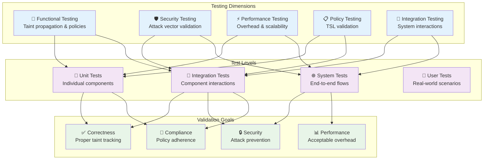

# Testing Information Flow Tracking

## Testing Strategy Overview

Information flow tracking systems require comprehensive testing across multiple dimensions to ensure correctness, security, and performance.

## Unit Testing Strategies

### Taint Propagation Testing
- **Basic propagation** - Verify taint labels flow correctly through operations
- **Hierarchical taints** - Test parent-child taint relationships
- **Taint removal** - Validate sanitization and untainting operations
- **Edge cases** - Empty inputs, null values, large data sets

### Policy Engine Testing
- **Sink blocking** - Verify policies correctly block/allow operations
- **Pattern matching** - Test regex-based untainting rules
- **Hierarchical policies** - Validate inheritance and override behavior
- **Policy composition** - Test complex policy combinations

### TSL Validation Testing
- **Schema validation** - Ensure TSL files conform to specification
- **Policy parsing** - Test loading and interpretation of TSL policies
- **Runtime updates** - Validate dynamic policy changes
- **Error handling** - Test malformed or conflicting policies

## Integration Testing Approaches

### Component Integration
- **Supervisor integration** - Test taint supervisor with policy engines
- **Pipeline integration** - Verify taint tracking in agent pipelines
- **Storage integration** - Test audit log persistence and retrieval
- **Monitoring integration** - Validate metrics and alerting systems

### Multi-Agent Testing
- **Cross-agent flows** - Test data flow between multiple agents
- **Policy consistency** - Ensure consistent policies across agents
- **Communication patterns** - Validate agent-to-agent taint propagation
- **Failure scenarios** - Test behavior when agents fail or disconnect

### External System Integration
- **Database integration** - Test taint tracking with data persistence
- **API integration** - Validate taint handling in external API calls
- **File system integration** - Test file operations with taint tracking
- **Network integration** - Verify taint handling in network operations

## Security Testing Methodologies

### Attack Vector Validation
- **Command injection** - Verify prevention of shell command injection
- **Data exfiltration** - Test blocking of sensitive data leakage
- **Prompt injection** - Validate protection against LLM prompt attacks
- **Path traversal** - Test file system access controls
- **SQL injection** - Verify database query protection

### Bypass Attempt Testing
- **Serialization bypass** - Test taint preservation through serialization
- **Type system bypass** - Verify type safety prevents taint removal
- **Policy circumvention** - Test attempts to work around policies
- **Timing attacks** - Validate consistent behavior regardless of taint

### Penetration Testing
- **Red team exercises** - Simulate real-world attack scenarios
- **Automated scanning** - Use security tools to find vulnerabilities
- **Social engineering** - Test human factors in taint policy adherence
- **Compliance validation** - Verify adherence to security standards

## Performance Testing Strategies

### Overhead Measurement
- **Baseline comparison** - Measure performance with/without taint tracking
- **Operation profiling** - Identify performance bottlenecks in taint operations
- **Memory usage** - Track memory overhead of taint metadata
- **CPU utilization** - Measure computational overhead

### Scalability Testing
- **Load testing** - Test performance under high data volumes
- **Stress testing** - Validate behavior at system limits
- **Concurrent operations** - Test performance with multiple simultaneous operations
- **Long-running tests** - Verify performance stability over time

### Optimization Validation
- **Caching effectiveness** - Test policy and taint lookup caching
- **Batch operations** - Validate performance of bulk taint operations
- **Lazy evaluation** - Test deferred taint computation strategies
- **Memory management** - Verify efficient taint metadata lifecycle

## Continuous Testing Practices

### Automated Test Suites
- **Unit test automation** - Comprehensive automated unit test coverage
- **Integration test pipelines** - Automated testing of component interactions
- **Security test automation** - Regular automated security validation
- **Performance regression testing** - Continuous performance monitoring

### Test Data Management
- **Synthetic data generation** - Create realistic test data with known taint properties
- **Test data isolation** - Ensure test data doesn't leak between tests
- **Data anonymization** - Remove sensitive data from test datasets
- **Test data versioning** - Track changes in test data over time

### Environment Management
- **Test environment isolation** - Separate test environments for different test types
- **Configuration management** - Consistent test environment setup
- **Deployment testing** - Test taint tracking in deployment scenarios
- **Rollback testing** - Validate system behavior during rollbacks

## Testing Tools and Frameworks

### Custom Testing Tools
- **Taint injection tools** - Utilities for creating test data with specific taints
- **Policy validation tools** - Automated TSL policy correctness checking
- **Audit log analyzers** - Tools for analyzing test audit logs
- **Performance profilers** - Specialized profiling for taint operations

### Integration with Standard Tools
- **Unit testing frameworks** - Integration with language-specific test frameworks
- **Security scanners** - Adaptation of security tools for taint-aware testing
- **Performance tools** - Integration with standard performance testing tools
- **CI/CD integration** - Automated testing in continuous integration pipelines

## Test Coverage Strategies

### Functional Coverage
- **Taint kind coverage** - Test all defined taint types
- **Operation coverage** - Test all taint-aware operations
- **Policy coverage** - Test all policy rules and combinations
- **Error path coverage** - Test all error conditions and edge cases

### Security Coverage
- **Attack vector coverage** - Test against known attack patterns
- **Compliance coverage** - Verify all regulatory requirements
- **Threat model coverage** - Test against identified threats
- **Vulnerability coverage** - Test fixes for known vulnerabilities

### Performance Coverage
- **Workload coverage** - Test various realistic workload patterns
- **Resource coverage** - Test under different resource constraints
- **Scale coverage** - Test at different system scales
- **Configuration coverage** - Test different system configurations

This comprehensive testing approach ensures that information flow tracking systems are correct, secure, performant, and reliable in production environments.